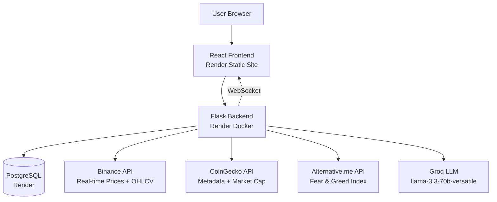

# ₿A$I – Blockchain AI Smart Investor

AI-powered crypto assistant that monitors the market, analyzes technical indicators, and provides intelligent, explainable trading insights. Designed for accessibility, it offers real-time updates, charts, and predictions to help users make informed decisions.

---

## 🌐 Live Demo

**[https://app.basiai.org](https://app.basiai.org)**

> **Note:** Hosted on Render free tier. The app may take 1-2 minutes to wake up after inactivity. Data refreshes automatically on startup.

> **Authentication Required:** The app requires authentication. You can create a free account to explore all features. You can delete your account at any time from the Account page.

---

## 📐 Architecture



---

## 🛠️ Tech Stack

### Backend
- **Python 3.12+**, **Flask**, **SQLAlchemy**, **Flask-Migrate**
- **Flask-SocketIO** (WebSocket for real-time updates)
- **gevent** (async worker for Socket.IO)
- **JWT** (Flask-JWT-Extended), **Bcrypt** (password hashing)
- **Resend** (email verification & password reset)
- **pandas-ta** (technical indicators), **Matplotlib** (chart generation)
- **NumPy**, **Pandas** (data processing)

### Frontend
- **React 18**, **Vite**, **Tailwind CSS**
- **TradingView Lightweight Charts** (interactive price charts)
- **Lucide React** (icon library)
- **Axios** (HTTP client), **Socket.IO Client** (WebSocket)

### Database
- **PostgreSQL** (production on Render)
- **SQLite** (local development)

### AI
- **Groq LLM** (`llama-3.3-70b-versatile` model for AI predictions)

### External APIs
- **Binance API** – Real-time prices and OHLCV historical data
- **CoinGecko API** – Coin metadata, market cap, global volume
- **Alternative.me API** – Fear & Greed Index

### DevOps
- **Docker** (backend containerization)
- **GitHub Actions** (CI/CD pipeline)
- **Render** (hosting: Docker backend, static frontend, PostgreSQL)

---

## ✨ Features

### Core Functionality
- **AI Predictions** with natural language reasoning (Buy/Sell/Hold recommendations)
- **Real-time WebSocket Dashboard** with live price updates every minute
- **Technical Indicators**: RSI, MACD, Bollinger Bands, Stochastic RSI, SMA, EMA
- **Trading Charts** with candlesticks, support/resistance levels, volume overlay
- **Fear & Greed Index** from Alternative.me (historical data + current value)
- **Top 24h Volume** with sparkline charts showing price trends
- **Coin Detail Pages** with TradingView charts and coin descriptions

### User Features
- **JWT Authentication** with email verification via Resend
- **Favorite Coins** – Save and manage preferred cryptocurrencies per user
- **Account Management** – Edit username, delete account
- **Password Reset** via email with secure token-based flow
- **Search Bar** for quick coin lookup in navbar
- **Coin Page Dropdown** – Quick navigation to any coin from navbar

### UI/UX
- **Mobile-Responsive** design with dark/light mode support
- **Subtle Background Animation** on auth pages (Ken Burns effect)
- **Live Updates** via WebSocket with REST API fallback
- **Loading States** and error handling throughout

---

## 🧠 How AI Prediction Works

1. **Data Collection**
   - Fetches OHLCV (Open, High, Low, Close, Volume) data from Binance API
   - Retrieves Fear & Greed Index from Alternative.me
   - Queries historical data from PostgreSQL database

2. **Technical Analysis**
   - Calculates indicators using `pandas-ta`:
     - **Trend**: SMA (50, 200), EMA (50, 200)
     - **Momentum**: RSI (14), MACD + Signal Line, Stochastic RSI (K%, D%)
     - **Volatility**: Bollinger Bands (upper, middle, lower)
   - Computes support and resistance levels from recent price windows

3. **AI Prediction**
   - Sends all indicators + market data to **Groq LLM** (`llama-3.3-70b-versatile`)
   - Receives **Buy/Sell/Hold** recommendation with natural language explanation
   - Two report modes:
     - **Concise**: Quick recommendation (500 tokens)
     - **Full**: Detailed analysis with reasoning (2500 tokens)

4. **Visualization**
   - Generates **Matplotlib charts**:
     - Price chart with candlesticks + SMA/EMA overlays
     - MACD/RSI chart with signal zones
     - Bollinger Bands chart with price action
   - Returns PNG images via Flask endpoints

---

## 🚀 Setup Instructions (Local Development)

### Prerequisites
- Python 3.12+ with pip
- Node.js 18+ with npm
- Git

### 1. Clone the Repository
```bash
git clone https://github.com/Ell-716/BASI-Crypto-Agent.git
cd BASI-Crypto-Agent
```

### 2. Backend Setup
```bash
# Create and activate virtual environment
python3 -m venv .venv
source .venv/bin/activate  # On Windows: .venv\Scripts\activate

# Install dependencies
pip install -r requirements.txt

# Set up environment variables
cp .env.example .env
# Edit .env and fill in your API keys (see Environment Variables section)

# Run database migrations
flask db upgrade

# Backfill historical data (required on first run)
python backfill.py

# Start the backend server
python app.py
```

> **Important Notes:**
> - **Never use `flask run`** — always use `python app.py` (Socket.IO requires gevent worker)
> - **VPN must be off** when running locally (Binance API may block VPN traffic)
> - Backend runs on `http://localhost:5050` by default

### 3. Frontend Setup
```bash
# In a separate terminal
cd frontend
npm install
npm run dev
```

Frontend runs on `http://localhost:5173` by default.

---

## 🔐 Environment Variables

Create a `.env` file in the project root with the following variables:

```bash
# Flask & JWT Configuration
SECRET_KEY=your-secret-key-here               # Flask secret key (generate with: python -c "import secrets; print(secrets.token_hex(32))")
JWT_SECRET_KEY=your-jwt-secret-key-here       # JWT signing key (generate with same command)

# API Keys
GROQ_API_KEY=your-groq-api-key                # Get from: https://console.groq.com/
RESEND_API_KEY=your-resend-api-key            # Get from: https://resend.com/

# Database
DATABASE_URL=sqlite:///crypto_agent_dev.db    # Local: SQLite, Production: PostgreSQL URL from Render

# URLs
FRONTEND_URL=http://localhost:5173            # Frontend URL (production: https://app.basiai.org)
BACKEND_URL=http://localhost:5050             # Backend URL (production: https://api.basiai.org)

# External APIs
BINANCE_BASE_URL=https://api.binance.com      # Production on Render: https://data-api.binance.vision
```

### Getting API Keys

- **Groq API**: Free tier available at [console.groq.com](https://console.groq.com/)
- **Resend**: Free tier (100 emails/day) at [resend.com](https://resend.com/)
- **Binance & CoinGecko**: No API key required for public endpoints

---

## 🧪 Testing

The project includes **40 pytest tests** covering:
- Authentication flow (register, login, email verification, password reset)
- AI prediction endpoints
- Coin data retrieval
- Environment configuration
- Database models

### Run Tests
```bash
# Activate virtual environment
source .venv/bin/activate

# Run all tests
pytest -v

# Run specific test file
pytest tests/test_auth.py
```

Tests use an in-memory SQLite database with mocked external API calls (Binance, CoinGecko, Groq).

---

## 🔄 CI/CD Pipeline

### GitHub Actions
- **Workflow**: `.github/workflows/ci.yml`
- **Triggers**: Every push to `main` and all pull requests
- **Steps**:
  1. Checkout code (`actions/checkout@v6`)
  2. Set up Python 3.12 (`actions/setup-python@v6`)
  3. Install dependencies
  4. Run full test suite with pytest
  5. Deploy to Render automatically on merge to `main`

### Deployment
- **Backend**: Deployed as Docker container on Render (auto-deploy from `main`)
- **Frontend**: Deployed as static site on Render (auto-deploy from `main`)
- **Database**: Managed PostgreSQL on Render

---

## 📡 API Endpoints

### Authentication (`/users`)
- `POST /users/add_user` – Register new user
- `POST /users/login` – Login and receive JWT tokens
- `GET /users/verify?token=<token>` – Verify email address
- `POST /users/resend-verification` – Resend verification email
- `POST /users/refresh` – Refresh access token
- `POST /users/request-password-reset` – Request password reset link
- `POST /users/reset-password` – Reset password with token

### Coins (`/api/coins`)
- `GET /api/coins` – List all supported coins (ordered by ID)
- `GET /api/coins/<coin_id>` – Get coin by ID
- `GET /api/coins/<coin_id>/history` – Get historical price data

### Dashboard (`/dashboard`)
- `GET /dashboard/fear-greed` – Current Fear & Greed Index
- `GET /dashboard/top-volume` – Top coins by 24h volume with sparklines
- `GET /dashboard/sparkline/<symbol>` – Sparkline chart data for specific coin
- `GET /dashboard/snapshot/<symbol>` – Market snapshot for specific coin
- `GET /dashboard/coins` – Top 10 coins data

### Predictions
- `GET /predict?coin=<symbol>&timeframe=<1h|1d|1w>&report_type=<concise|full>` – Get AI prediction
  - Returns: JSON with analysis text, charts (base64 encoded)

### Charts (`/chart`)
- `GET /chart/price/<symbol>?timeframe=<1h|1d|1w>` – Price chart PNG
- `GET /chart/macd-rsi/<symbol>?timeframe=<1h|1d|1w>` – MACD/RSI chart PNG
- `GET /chart/bollinger/<symbol>?timeframe=<1h|1d|1w>` – Bollinger Bands chart PNG

### User Management (`/users`)
- `GET /users/<user_id>` – Get user profile (JWT required)
- `PUT /users/<user_id>` – Update username and favorite coins (JWT required)
- `DELETE /users/<user_id>` – Delete account (JWT required)

### WebSocket Events (`/socket.io`)
- `connect` – Client connects, receives initial coin data
- `coin_data` – Server emits live price updates every minute
- `request_coin_data` – Client can request immediate data update
- `disconnect` – Client disconnects

---

## 🚢 Deployment Notes

### Render Configuration
- **Backend**: Docker deployment
  - Build command: `docker build -t basi-backend .`
  - Start command: `python app.py`
  - Port: 5050
  - Environment: `BINANCE_BASE_URL=https://data-api.binance.vision`

- **Frontend**: Static site
  - Build command: `cd frontend && npm install && npm run build`
  - Publish directory: `frontend/dist`

- **Database**: PostgreSQL (Render managed service)

### Render Free Tier Behavior
- App **spins down after 15 minutes** of inactivity
- **Cold start**: ~1-2 minute delay on first request after spin-down
- **Data refresh**: Automatic on cold start if data is older than 6 hours
  - Historical data: 6-hour staleness threshold
  - CoinGecko snapshots: 24-hour staleness threshold
  - Fear & Greed Index: 24-hour staleness threshold

### Cron Jobs (For Always-On Hosting)
The codebase includes cron scripts for production use:

```bash
# backend/cron_update.py - Update historical data & indicators
# Run hourly: 0 * * * *

# cron_update_fgi.py - Update Fear & Greed index
# Run daily at 04:05: 5 4 * * *

# cron_update_top_volume.py - Update top volume
# Run daily at 02:15: 15 2 * * * *

# cron_update_snapshot.py - Update Market cap and Volume
# Run daily at 02:00: 0 2 * * *
```

> **Note**: Cron jobs are **not needed on Render free tier** due to automatic data refresh on cold start. They are designed for paid hosting with always-on backends.

---

## ⚠️ Known Limitations

### Free Tier Constraints
- **Cold start delay**: 1-2 minutes after 15 min inactivity
- **WebSocket intermittency**: May disconnect during periods of low activity
- **Rate limiting**: Shared IP may be rate-limited by external APIs (Binance, CoinGecko)

### Data Freshness
- **1-hour predictions** require historical data less than 6 hours old
- **Weekly predictions** always fetch fresh data from Binance (no DB dependency)

### Email
- Verification and password reset emails sent from custom domain: `noreply@basiai.org`

### Binance API Access
- **VPN users**: Binance API blocks some VPN IPs (use `BINANCE_BASE_URL=https://data-api.binance.vision` workaround)
- **Geo-restrictions**: Some regions may be blocked by Binance

---

## 🔮 Future Improvements

- [ ] **Migrate to FastAPI** – Improve async performance and API documentation
- [ ] **Portfolio Tracking** – Track holdings, profit/loss, realized gains
- [ ] **Price Alerts** – Email/push notifications for price targets
- [ ] **Strategy Layer** – Combine predictions with risk management (stop-loss, take-profit)
- [ ] **Historical Backtesting** – Test AI predictions against past data
- [ ] **Multi-LLM Support** – Compare predictions from different models (GPT-4, Claude, etc.)
- [ ] **Mobile App** – React Native version with push notifications

---

## 📄 License

This project is licensed under the **MIT License** — see the [LICENSE](LICENSE) file for details.

> **Disclaimer**: This project is for **educational and demonstration purposes only**. It is **not financial advice**. Cryptocurrency trading involves substantial risk of loss. Always do your own research before making investment decisions.

---

## 👤 Author

**Created with passion by Elena Bai**

- GitHub: [@Ell-716](https://github.com/Ell-716)
- Email: elenabai.2021@gmail.com

---

<div align="center">
  <p><strong>Copyright © 2025-2026 Elena Bai. All rights reserved.</strong></p>
  <p>⭐ If you find this project helpful, please give it a star on GitHub! ⭐</p>
</div>
